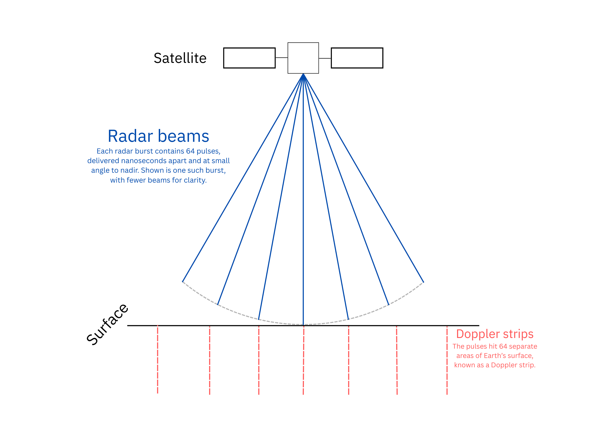
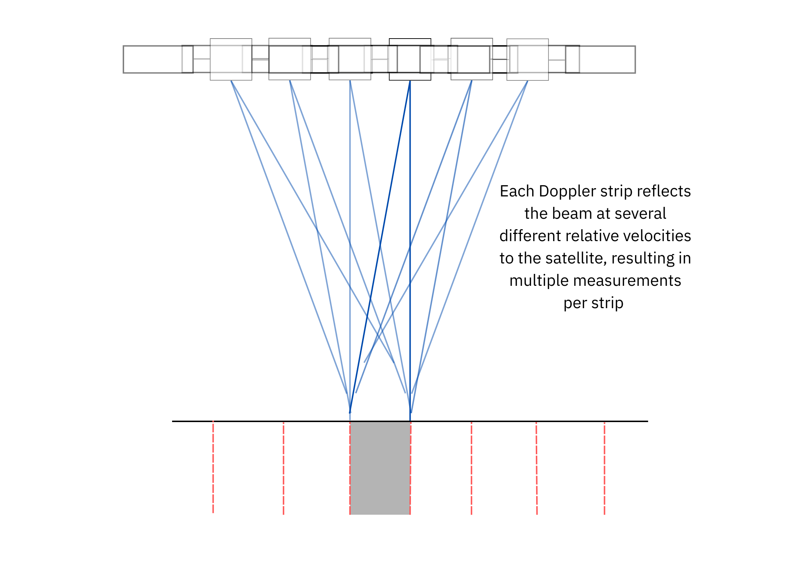
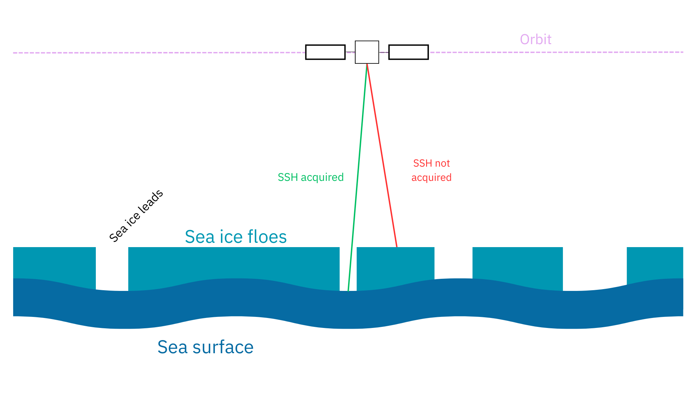
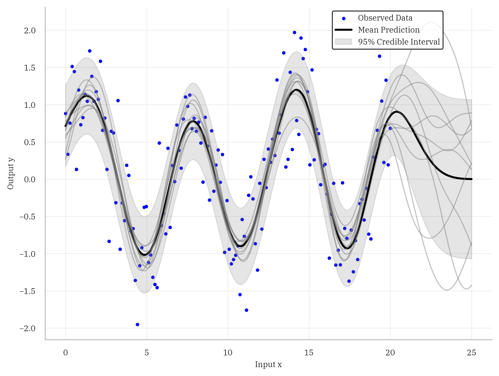

# GEOL0069 Final Assignment
This repository is the final assignment for the UCL Earth Sciences module GEOL0069 "AI for Earth Observation".

## Project background
### The problem
Satellite altimetry missions use sythetic aperture radar (SAR) to find the surface height measurements of sea ice, open ocean, and many other surface types. Surface height measurements of ocean through cracks in sea-ice (known as leads) can be used to infer the sea level anomaly (SLA) of the ocean under the surface of sea ice. SLA is defined as the sea surface height minus the mean sea surface:

$$ SLA = SSH - MSS $$

This provides an idea of the sea surface's deviation from the mean and can be used in eddy tracking. The process of infering this SLA, however, can be challenging due to the limitations on acquiring SLA datapoints. Not all measurements made by the satellite altimeter at the footprint resolution will contain leads and so an effective interpolation algorithm must be used. The focus of this project is to determine the strengths of different algorithms for this purpose.

Shown in this project is the performance of a linear interpolation algorithm and a machine learning package developed by UCL's Centre for Polar Observation and Modelling (CPOM), known as GPSat.

The process of SAR is shown in the graphics below:






## Steps to install
First, clone the packages from their respective Git repositories:
```
git clone https://github.com/CPOMUCL/GPSat.git
git clone https://github.com/totony4real/DeepRandomFeatures.git
```

From inside `path/to/GPSat`:

```
conda create -n geol0069_gpsat python=3.11
conda activate geol0069_gpsat
python -m pip install -r requirements.txt
python -m pip install -e ./
```

From inside `path/to/DeepRandomFeatures`:
```
conda create -n geol0069_drf python=3.11
conda activate geol0069_drf
python -m pip install -r requirements.txt
python -m pip install -e ./
```

